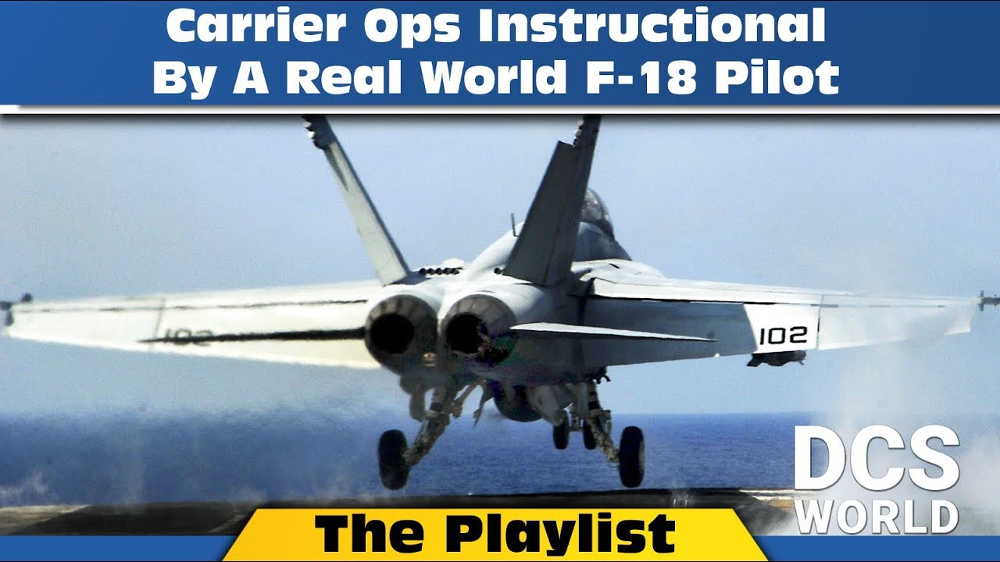
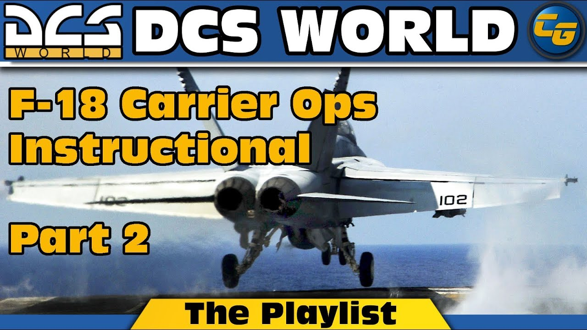
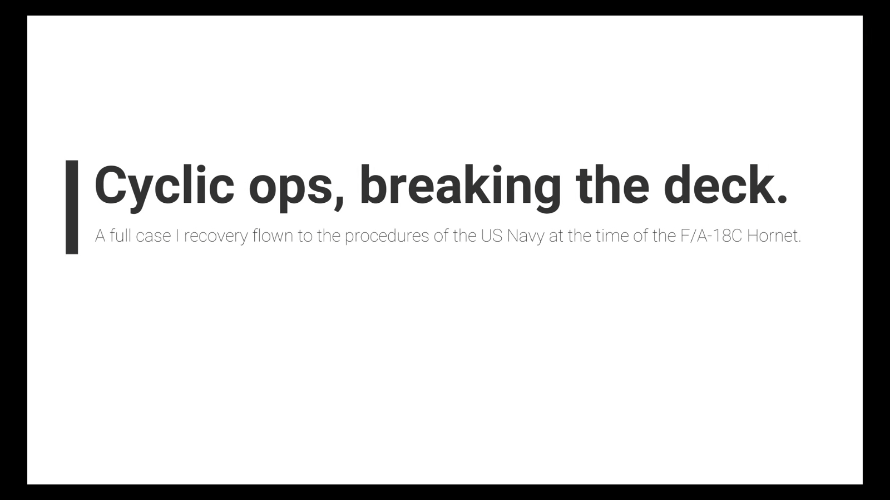
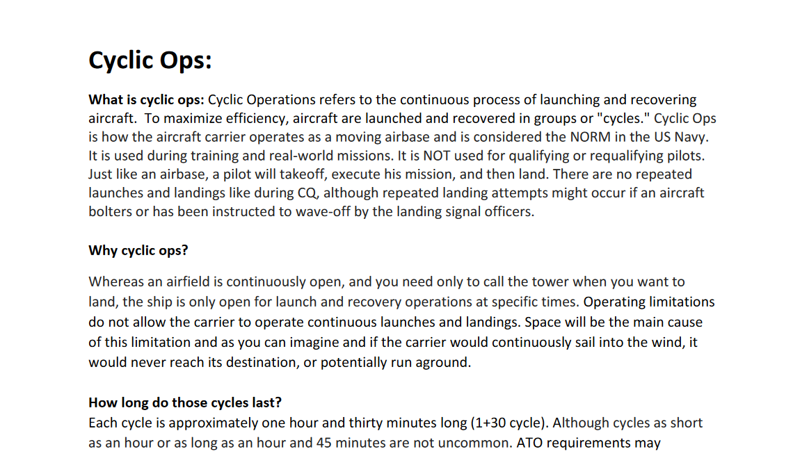

{}
Although much of this material is valuable to all virtual pilots, the focus of this site is on training material for the F/A-18C Hornet.
{}

## Carrier Ops

### The carrier ops bible
{}
Comprehensive guide to carrier ops written by Pieterras / DCS-Sn@k3Sh!t with the help from real life navy pilots. 
[Open the document](https://drive.google.com/file/d/13iSdavDzoHkTkoaD3ulQPprLWfjKCww-/view)
{}

### Lex's boat ops videos
{}
{}

{}
{}

{}
{}

### Pieter Ras video and document
{}
{}

{}
{}

{}
{}

### NATOPS documents - the real deal
It is said that the Naval Air Training and Operating Procedures Standardization (NATOPS) documents are "written in blood". These documents are used by real navy pilots. The documents are often the result of decades of experience in naval aviation and they provde operational standards for aircraft, equipment, carrier procedures and more.

{}
NATOPS documents provide very detailed and comprehensive information
{}

Be aware that those documents are restricted to U.S. government and their contractors only. So you better not search for them on the internet, please.

### CNATRA documents
Issued by the Chief of Naval Air Training, this collection of documents covers the training of future naval aviators or naval flight officers. Although documents from the advanced phases of flight training are not publicly available (anymore), many of the early phases are. Be aware that some topics are artificially simplified or adapted for training purposes. Later, in the fleet, other rules may apply.
 - [CNATRA PDF publications](https://www.cnatra.navy.mil/pubs-pat-pubs.asp)
 - [CNATRA API videos and documents](https://www.cnatra.navy.mil/api.asp)
 - [NATRACOM Videos](https://www.cnatra.navy.mil/natracom-videos.asp)