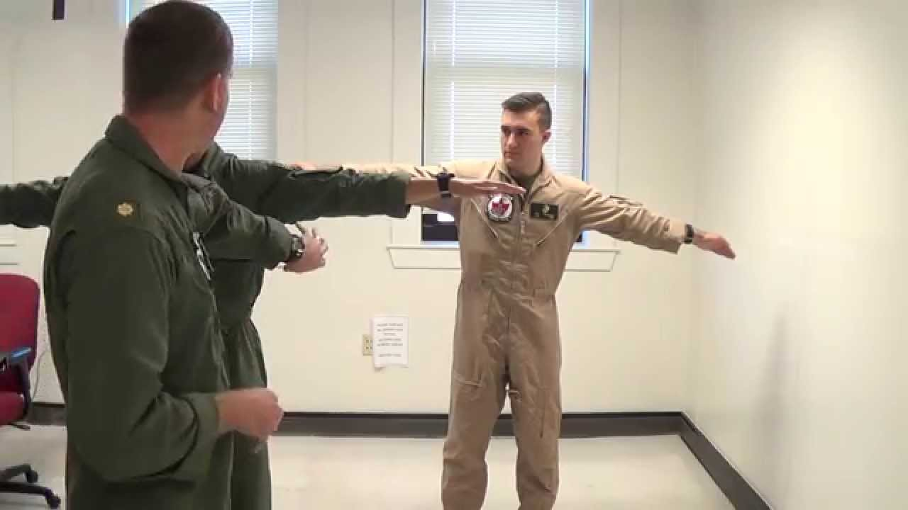
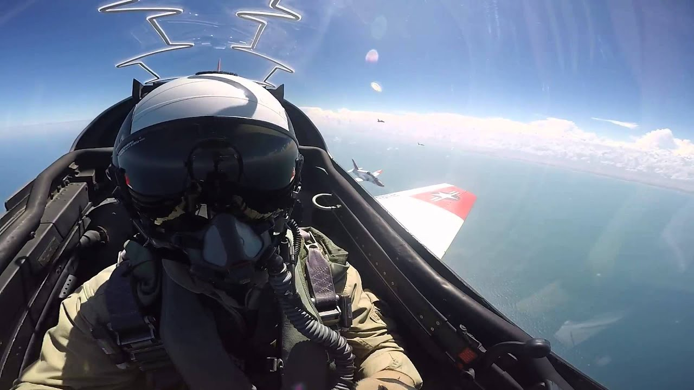
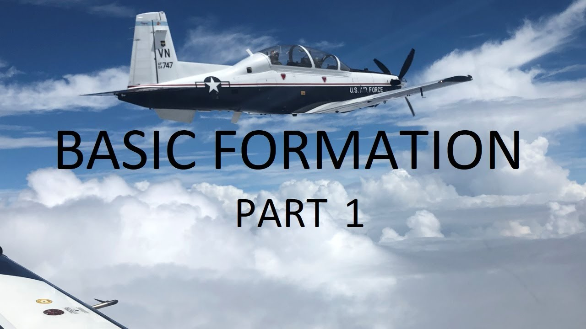

{}
Although much of this material is valuable to all virtual pilots, the focus of this site is on training material for the F/A-18C Hornet.
{}

### Primary flight training
{}

{}

{}

{}

{}

{}

{}

{}

