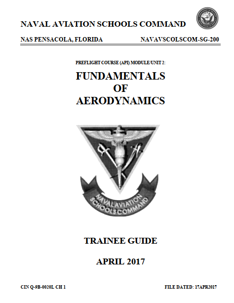
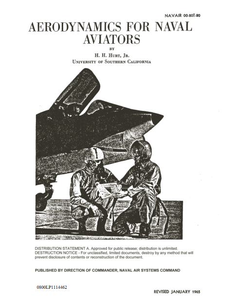
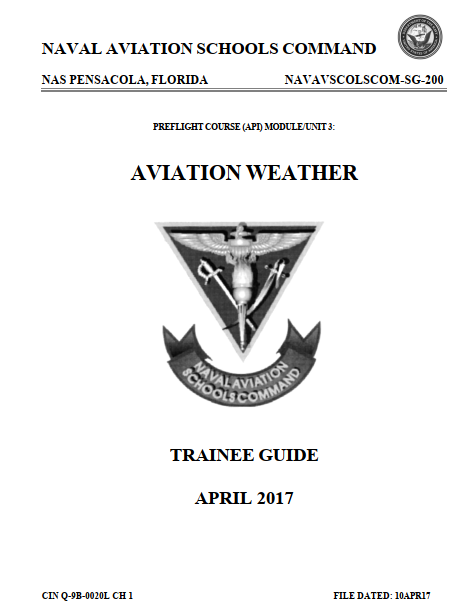
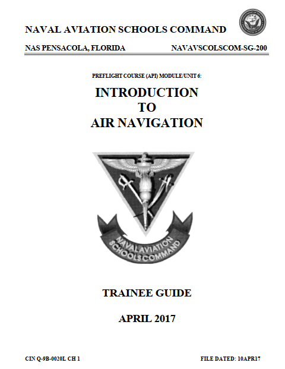
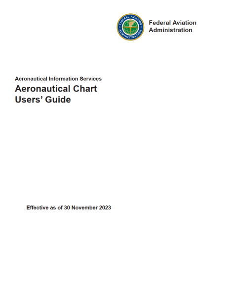
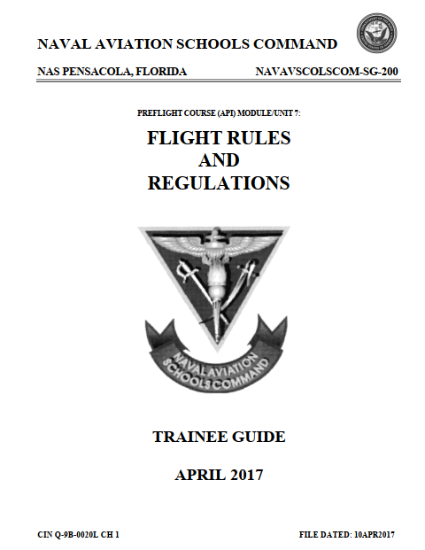

{}
Complying with the "Public Use Notice of Limitations" of the U.S. Department of Defense (DoD), we declare that
"The appearance of U.S. Department of Defense (DoD) visual information does not imply or constitute DoD endorsement."

We present this material solely for educational purposes in the field of flight simulation.
{}

### Aerodynamics

{}
{}

{}
{}

{}
{}
### Weather

{}

{}

### Aircraft Systems 

{}

{}

### Navigation 
{}
{}

{}

{}

{}
{}

### Regulations 

{}

{}