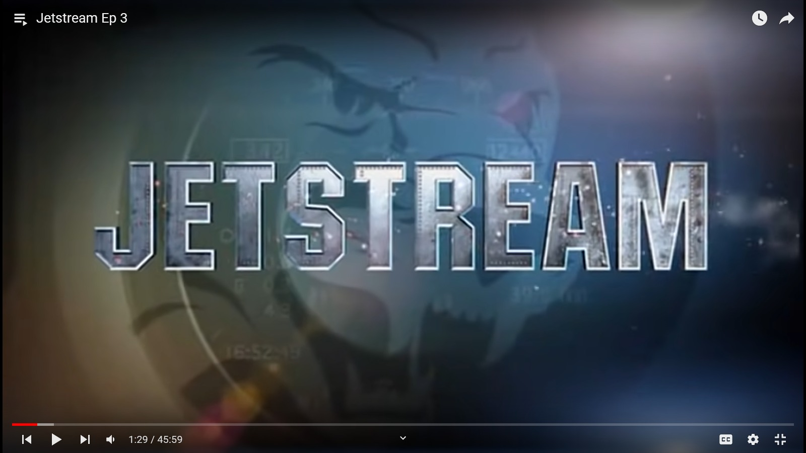
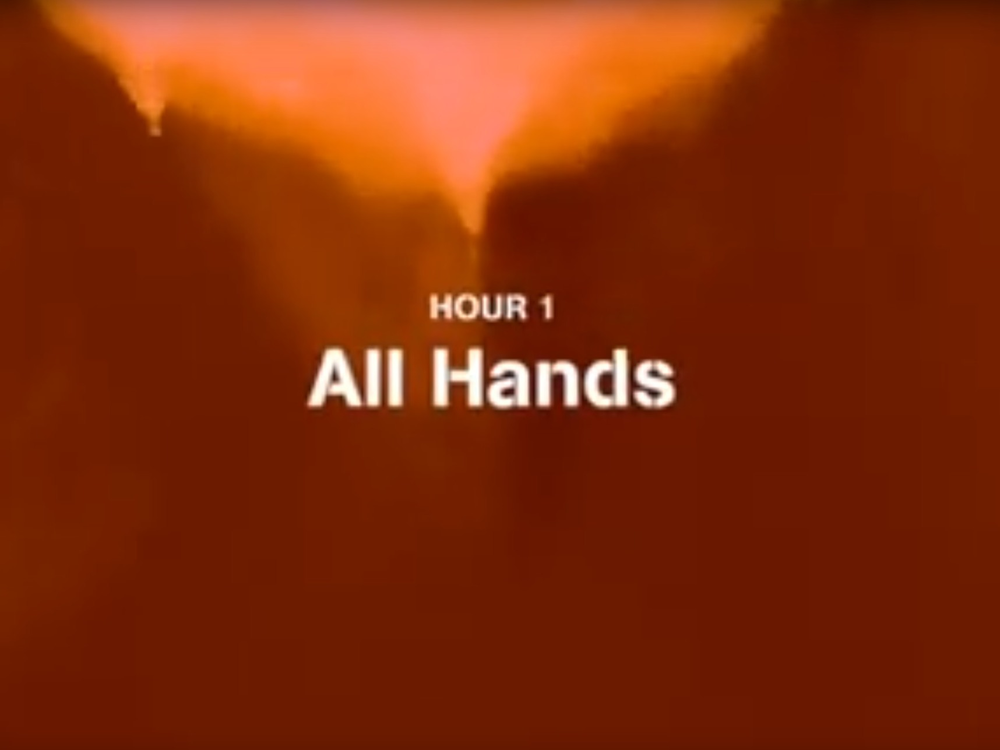
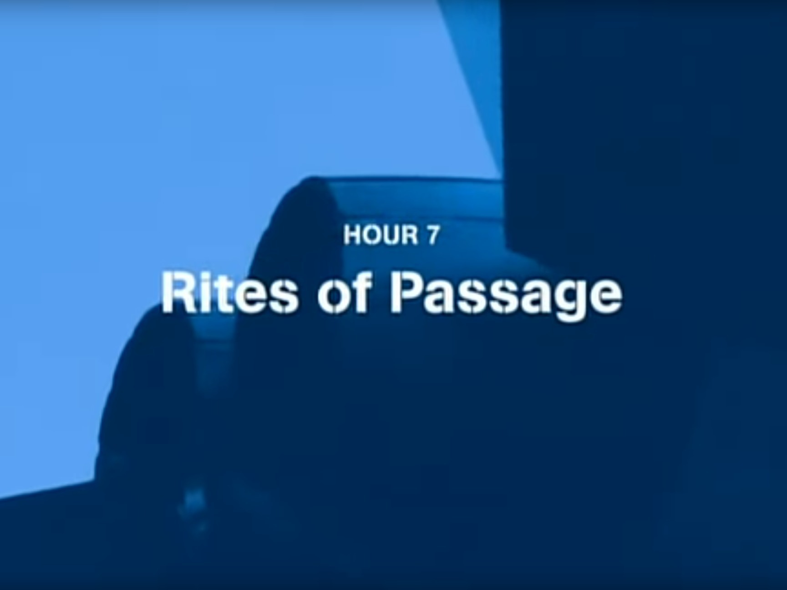
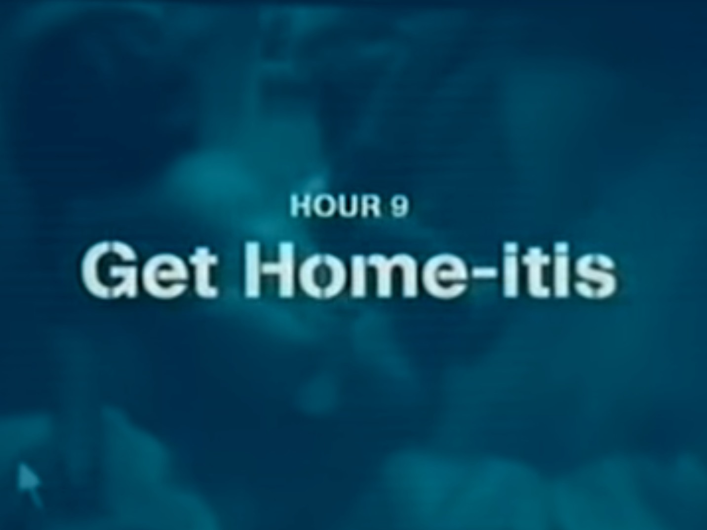

### Jetstream - Canadian pilot training 
{}

{}
{width=200}
{}

{}

### Carrier PBS
A documentary about life and work on an aircraft carrier. You might find more episodes online if you're lucky. There's also [an old webpage.](https://www.pbs.org/weta/carrier/) and Amazon Prime.
{}

{}

{}

{}

{}

{}

{}

{}

